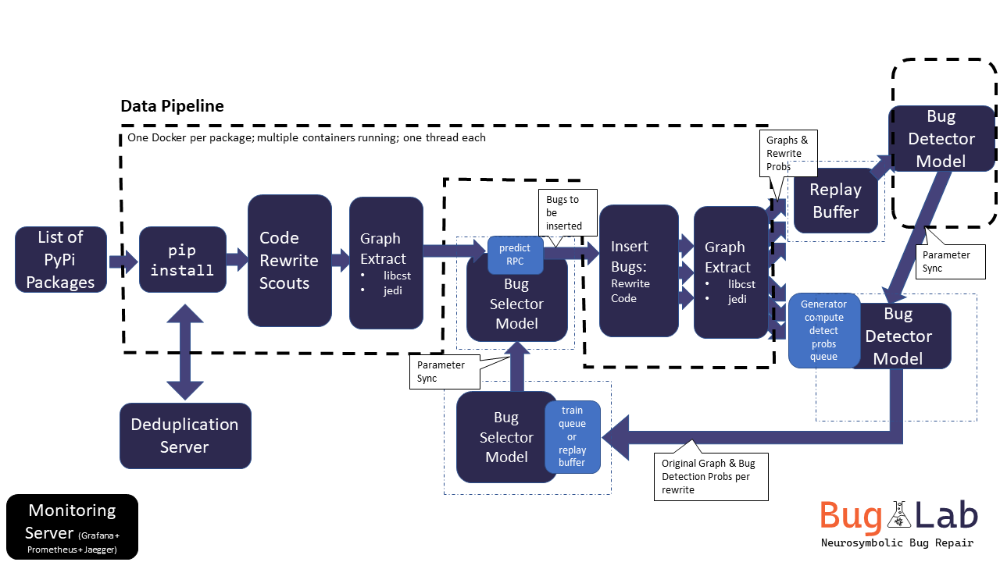

# Self-Supervised Bug Detection and Repair

This is the reference code to replicate the research in [Self-Supervised Bug Detection and Repair](https://arxiv.org/abs/2105.12787) in NeurIPS 2021.
Note that due to internal dependencies, it is not possible to share the whole infrastructure. We provide
instructions to run the supervised learning parts. For the self-supervised, we provide the code as-is and some
documentation below but it's not directly replicable without substantial work to setup the relevant infrastructure.

Please cite as,
```
@inproceedings{allamanis2021self,
  title={Self-Supervised Bug Detection and Repair},
  author={Allamanis, Miltiadis and Jackson-Flux, Henry and Brockschmidt, Marc},
  booktitle={NeurIPS},
  year={2021}
}
```

## Table of Content
<!---toc start-->

* [Self-Supervised Bug Detection and Repair](#self-supervised-bug-detection-and-repair)
  * [Table of Content](#table-of-content)
  * [Random Bugs Data Extraction](#random-bugs-data-extraction)
  * [PyPIBugs Dataset](#pypibugs-dataset)
  * [Training Models](#training-models)
    * [Supervised Learning Mode](#supervised-learning-mode)
    * [Self-Supervised Learning Mode](#self-supervised-learning-mode)
  * [Repository Structure](#repository-structure)
    * [Utilities](#utilities)
      * [Viewing *.msgpack.l.gz](#viewing-msgpacklgz)
      * [Visualizing graph representation](#visualizing-graph-representation)
      * [Interactive Model Explorer](#interactive-model-explorer)
  * [Infrastructure](#infrastructure)
    * [Architecture](#architecture)
    * [Spawning the BugLab infrastructure](#spawning-the-buglab-infrastructure)
      * [Initialise Terraform](#initialise-terraform)
      * [Get the Kubernetes Credentials and Connect to K8s](#get-the-kubernetes-credentials-and-connect-to-k8s)
        * [Useful K8s commands](#useful-k8s-commands)
    * [Starting experiments](#starting-experiments)
        * [Monitoring](#monitoring)
        * [Resource monitoring](#resource-monitoring)
        * [Experiment monitoring](#experiment-monitoring)
  * [Developing](#developing)
      * [Running Tests](#running-tests)
  * [Contributing](#contributing)
  * [Trademarks](#trademarks)

<!---toc end-->


## Random Bugs Data Extraction
To create a dataset with fixed (randomly selected) bugs, use the following instructions:

1. Build the Docker container for extraction by navigating to the root directory and running. Start :
    ```commandline
    docker build -f deployment/dockerfiles/baseimage.Dockerfile -t buglab-base .
    ```
1. Create a text file containing the names of the PyPi packages to be extracted.
    * You can find the 4k most downloaded packages [here](https://hugovk.github.io/top-pypi-packages/).
    * You can get a list of _all_ PyPi packages using the utilities in `buglab.data.pypi.utils.get_all_pypi_packages`.
1. Start the extraction
    ```commandline
    python -m buglab.controllers.staticdatasetextractor package_list_path target_dir
    ```
   The results will be saved at the `target_dir`.
   The code will create multiple processes each spawning
   a Docker container that is executing the main in
   `buglab.controllers.packageextracttodisk` that extracts the
   data from a single package.

   Note that by default the extraction runs as many Docker
   containers as CPUs in the current machine.
1. Split the dataset
    ```commandline
    python -m buglab.data.split ALL_DATA_FOLDER OUTPUT_FOLDER
    ```
   the split is deterministic with respect to the filename.

To view the saved data, you can use the CLI utility see [Viewing *.msgpack.l.gz](#viewing-msgpacklgz).

## PyPIBugs Dataset

We provide the PyPIBugs dataset as a set of URLs and git SHAs, which
can be used to re-extract the dataset. Please download the dataset from
[here](https://www.microsoft.com/en-us/download/103554). The dataset
has a json lines ([JSONL](https://jsonlines.org/)) format with each
line having the format:
```
{
    "repo": "url-to-git",
    "hash": "SHA of bug fixing commit",
    "diff": "diff hunk",
    "old_path": "filepath wrt to repo root",
    "rewrite": "the bug fixing rewrite metadata"
}
```

Using this data, and as long as the original repository is
present online and its history is _not_ rewritten, the
dataset can be extracted in a usable format. Please look at
[`get_pypibugs.py`](/buglab/data/diffmining/get_pypibugs.py)
for a script scaffold that allows data re-extraction.
The code automatically, reads in the PyPiBugs dataset, clones
the repos and checkouts out the appropriate commits.
The `visit_buggy_code` and `visit_fixed_code` need to be implemented:
* `visit_buggy_code` is called on the version of the code before fixing the bug.
        The full repository and is accessible at the `repo_path` argument.
* `visit_fixed_code` is called immediately after `visit_buggy_code` and the
        repository is at the version after the bug is fixed.

Finally, [`buglab.data.extract`](/buglab/data/diffmining/extract.py)
extracts the dataset in the format used in this work.

## Training Models
### Supervised Learning Mode
To train supervised model over a fixed dataset of (random) bugs, run
```commandline
python buglab/models/train.py MODEL_NAME TRAIN_DATA_PATH VALID_DATA_PATH MODEL_FILENAME
```
The models `gnn-mlp` and `seq-great` are those described in the paper.
To define a new model, add it to the [model registry](/buglab/models/modelregistry.py).

To evaluate a model run
```commandline
python buglab/models/evaluate.py MODEL_FILENAME TEST_DATA_PATH
```

Finally, to visualize the output of a model in an html file, run
```commandline
python buglab/models/visualize.py MODEL_FILENAME DATA_PATH OUT_HTML
```

### Self-Supervised Learning Mode

You may need to create your own infrastructure. Please, see the relevant section in this README file.
The following instructions assume a manual start-up of all controllers. See [here](#architecture) for a high-level description
of the different processes involved.

The code is developed in a decoupled fashion, such that it can be run across multiple
processes/computers. Processes communicate (via the network or IPC) with [ZeroMQ](https://zeromq.org/).
For the full BugLab to run, a number of processes need to be spawned. Follow the instructions
below or start the relevant pods in your Kubernetes cluster using the Helm recipe in [`deployment`](/deployment/).

1. Build the Docker container for extraction by navigating to the root directory and running2. Start:
    ```commandline
    docker build -f ./deployment/dockerfiles/baseimage.Dockerfile  -t buglab-extract .
    ```
2. Start a bug selector server. This is responsible for selecting bugs to introduce when generating data
   for the bug detector. To use the random selector
    ```commandline
    python -m buglab.controllers.randombugselectorserver "tcp://*:5556"
    ```
    Alternatively, this maybe a learned model,
    ```commandline
    python -m buglab.controllers.bugselectorserver
    ```
3. Start the data generating pipeline server
    ```commandline
    python -m buglab.controllers.datageneratingpipeline_coordinator package_list_path
    ```
   where the `package_list_path` is a list of packages (text file; one package per line). See the fixed data extraction
   for more information about retrieving the `package_list_path`. This process is responsible for distributing work
   across a number of workers, instantiates a deduplication server, and acts a proxy among workers and the training processes.
4. Start one or more (usually around 400) processes for extracting the graph representations of source code. Each
   process consults the `datageneratingpipeline_coordinator`, installs a package from PyPI and inserts bugs (rewrites
   the code) and extract the graph representation. Each sample is then passed into the training process.
   ```commandline
   python -m buglab.controllers.datageneratingpipeline_worker
   ```
   Please look at the command-line arguments for defining the addresses (IPs, ports) to the bug selector server,
   deduplication server, pipeline coordinator, for more fine-grained control.
5. Start the bug detector training process, the detector model server, and its data buffer
   ```commandline
    python -m buglab.controllers.trainbugdetector PATH_FOR_METADATA_INIT MODEL_CONFIG OPTIONAL_VALIDATION_DATA_PATH MODEL_SAVE_PATH
    python -m buglab.controllers.detectortrainingdatabuffer PATH_OF_INITIAL_DATA
   ```
   Again check the command line arguments for more fine-grained options.
6. Start the bug selector training process, the bug selector model server, and the scoring pipeline which
   scores the data with the detector probabilities used for the selector loss
   ```commandline
    python -m buglab.controllers.trainbugselector MODEL_CONFIG MODEL_SAVE_PATH
    python -m buglab.controllers.detectordatascoringworker PATH_OF_INITIAL_DATA
   ```
   Check the command line arguments for more fine-grained options.

7. Finally, you may peek at the output of the extraction server by running the
    dummy data subscriber
    ```commandline
    python -m buglab.controllers.dummydatasubscriber
    ```
   which will subscribe to the dataset extraction publisher.

## Repository Structure
A high-level overview of the structure of the code follows:

* [`buglab.representations`](/buglab/representations) contains code to convert Python 3.x code into
  its graph representation. Each pass (data flow, control flow, etc) can be found in the [`coderelations`](/buglab/representations/coderelations)
  folder.
* [`buglab.rewriting`](buglab/rewriting) contains code to perform rewrites (e.g. rewrites that [introduce bugs](buglab/rewriting/rewriteops.py)
   or rewrites that commonly [preserve semantics](buglab/rewriting/semanticspreserving.py).)
* [`buglab.data.deduplication`](buglab/data/deduplication) a client-server for streaming code deduplication.
* [`buglab.models`](buglab/models) contains the high-level definitions of the models used. To define a new model,
   add it to the [model registry](buglab/models/modelregistry.py). Entry points for supervised training, evaluation,
   and visualization are provided here.
* [`buglab.controllers`](buglab/controllers) that contains entry points for the various processes used
  during self-supervised training. These can be invoked individually, and are also created by a Helm
  deployment (defined in [`deployment`](deployment/buglab))

### Utilities

#### Viewing *.msgpack.l.gz
To view the contents of a gzipped list of messagepack files, run
```commandline
python -m buglab.utils.msgpackutils path/to/file.msgpack.l.gz | less
```

#### Visualizing graph representation
This requires GraphViz and Dot. To get the graph of a single file run
```commandline
python -m buglab.representations.asdot path/to/file.py output/path.dot
dot -Tpdf output/path.dot > output/path.pdf
```

#### Interactive Model Explorer
To get an interactive mode for experimenting with a given model, run
```commandline
streamlit run buglab/controllers/helper/modelexplorer.py path/to/models/dir/
```

Note that this requires an installation of [`streamlit`](https://www.streamlit.io/).

## Infrastructure
The BugLab compute infrastructure is managed through Terraform and Kubernetes.
**This is provided as-is and no support will be provided by the maintainers to run the infrastructure**
All relevant code is found in the [`deployment/`](deployment) folder and is
relevant to running BugLab on Azure.
Note that the [`variables.tf`](deployment/terraform/variables.tf) needs
to be populated with user-specific variables.
Terraform is responsible for creating the Azure infrastructure including an
appropriately configured Kubernetes cluster. Helm is the templating language
used to define Kubernetes deployments.

First, make sure you have installed [Azure CLI](https://docs.microsoft.com/en-us/cli/azure/), [terraform](https://www.terraform.io/downloads.html),
[kubectl (kubernetes cli)](https://kubernetes.io/docs/tasks/tools/install-kubectl/), and
[helm](https://helm.sh/).

### Architecture
The high-level architecture of the infrastructure and communicating
processes can be seen in the image below.


### Spawning the BugLab infrastructure
If you are recreating this project, rather than working on an already-started version of it,
you will need to register an app, create a service principal, and a client secret following the instructions
[here](https://registry.terraform.io/providers/hashicorp/azurerm/latest/docs/guides/service_principal_client_secret).
You can find more detail on apps and service principals
[here](https://docs.microsoft.com/en-us/azure/active-directory/develop/app-objects-and-service-principals) if you need it.
Make sure that the service principal has "contributor" rights for your resource group.

#### Initialise Terraform
Once you have filled [`variables.tf`](deployment/terraform/variables.tf)  open up a shell and navigate to the Terraform directory
and run `terraform init`:
```commandline
cd $CODE/BugLab/deployment/terraform
terraform init
```

> You might need to login with the Azure CLI if an error occurs.


#### Get the Kubernetes Credentials and Connect to K8s
To connect your `kubectl` command with the Kubernetes cluster that Terraform is now managing for you,
dump the output of `terraform output kube_config` into a file somewhere. In powershell:
```commandline
terraform output -raw kube_config | Out-File -FilePath azurek8s
```
or bash:
```commandline
terraform output -raw kube_config > azurek8s
```
will put it in a file called `azurek8s` within the `terraform` directory.

Then set your `KUBECONFIG` environment variable to point towards this file. In powershell:
```commandline
$Env:KUBECONFIG = "C:\path\to\azurek8s"
```
and bash:
```commandline
export KUBECONFIG="/path/to/azurek8s"
```

Now, running the command `kubectl get nodes` _should_ give you a list of all of the compute nodes
which are defined in the `kube.tf` file.

##### Useful K8s commands
Kubernetes is a useful tool with a steep learning curve. We should keep some of the more useful
commands here for reference. It will not be an exhaustive list at all.

To see what pods are running, run
```commandline
kubectl get pods
```
The output will look something like:
```commandline
NAME                             READY   STATUS    RESTARTS   AGE
train-selector-bc6cb4b4f-zjmg7   1/1     Running   0          42m
```
with possibly pods, depending on what is currently running. To see logs from a pod you are interested
in, run:
```commandline
kubectl logs train-selector-bc6cb4b4f-zjmg7
```
(where the name is copied from the output of `kubectl get pods`).

For more detail about the pod creation process (useful if the `STATUS` is `Failed` or something
similarly disappointing), run:
```commandline
kubectl describe pod train-selector-bc6cb4b4f-zjmg7
```

If the pod status is `RUNNING`, but you want to check if
- data has mounted properly
- the GPU exists
- the expected processes are running

or similar, you can connect directly to a pod and get an interactive prompt using the command:
```commandline
kubectl exec --stdin --tty train-selector-bc6cb4b4f-zjmg7 -- bash
```
Your prompt will then be that of the container running in the pod, and you should then be able to
run `nvidia-smi`, `htop` or any other of your favourite inspection tools.

### Starting experiments
To start an experiment in the K8s cluster use `helm`. First navigate to the `deployment` folder where
the `buglab` Helm chart is located. Then kick-off an experiment:
```
helm install NAME_OF_EXPERIMENT ./buglab/ -n NAME_OF_EXPERIMENT --create-namespace -f config.yml
```
you can use the `--dry-run` option to check the Kubernetes configuration before running.

To stop an experiment run
```
helm uninstall NAME_OF_EXPERIMENT -n NAME_OF_EXPERIMENT
```

##### Monitoring
There are two instances of Grafana that will be useful for monitoring experiments. One is for
monitoring the compute resources in the cluster, and the other is for monitoring your specific
experiment.

##### Resource monitoring
To see a cluster wide monitor to check how compute resources are being used, you will want to
connect to the Grafana service on the `monitoring` namespace. Run the command
```commandline
kubectl --namespace monitoring port-forward svc/kube-prometheus-stack-grafana 8080:80
```
and then navigate to `localhost:8080`. The username is `admin` and password is `prom-operator`. There
are many dashboards pre-configured to look at the compute resources broken down by pod and node.

It looks like GPU use monitoring is not supported for the type of GPU we are currently using.
Following instructions from [here](https://developer.nvidia.com/blog/monitoring-gpus-in-kubernetes-with-dcgm)
I tried installing the metric exporter. The command
```commandline
helm install --generate-name gpu-helm-charts/dcgm-exporter -f .\deployment\terraform\nvidia_values.yaml
```
works successfully, but the pods themselves fail with logs:
```commandline
level=fatal msg="Error watching fields: Profiling is not supported for this group of GPUs or GPU"
```
It might be worth trying again at later, when GPU support has broadened.

##### Experiment monitoring
When you start an experiment using the `helm install` command described in the previous section,
it will start a Grafana instance running in the namespace that you specified. Find it's name by
first running
```commandline
kubectl --namespace NAME_OF_EXPERIMENT get pods
```
and then connecting to by running (something like)
```commandline
kubectl --namespace NAME_OF_EXPERIMENT port-forward grafana-5f977fdd7c-zpqcd 3000
```
Note the difference in port! You need to connect to 3000 in this instance. Navigate to `localhost:3000`.
The username and password are both `admin` for this instance.

The `json` definition of the dashboards that are loaded by default are stored in this repo in the
`grafana/dashboards` directory. However, they are actually read from the `grafana` blob container
in the BugLab storage account. If you make changes in the `grafana/dashboards` directory, they will
not be reflected in the dashboards that you actually see until you (manually) sync the changes with
to the `grafana` blob, and then restart your Grafana service.

## Developing
To contribute to this project, first follow the next steps to setup your
development environment:
* Install the library requirements.
* Install the pre-commit hooks:
    * Run `pip3 install pre-commit`
    * Install the hooks `pre-commit install`


#### Running Tests
The test suite takes a long time to run, thus first select the test that you're
interested in running.
```commandline
pytest -k "name_of_test" -s .
```
at the root of the project.

## Contributing

This project welcomes contributions and suggestions.  Most contributions require you to agree to a
Contributor License Agreement (CLA) declaring that you have the right to, and actually do, grant us
the rights to use your contribution. For details, visit https://cla.opensource.microsoft.com.

When you submit a pull request, a CLA bot will automatically determine whether you need to provide
a CLA and decorate the PR appropriately (e.g., status check, comment). Simply follow the instructions
provided by the bot. You will only need to do this once across all repos using our CLA.

This project has adopted the [Microsoft Open Source Code of Conduct](https://opensource.microsoft.com/codeofconduct/).
For more information see the [Code of Conduct FAQ](https://opensource.microsoft.com/codeofconduct/faq/) or
contact [opencode@microsoft.com](mailto:opencode@microsoft.com) with any additional questions or comments.

## Trademarks

This project may contain trademarks or logos for projects, products, or services. Authorized use of Microsoft
trademarks or logos is subject to and must follow
[Microsoft's Trademark & Brand Guidelines](https://www.microsoft.com/en-us/legal/intellectualproperty/trademarks/usage/general).
Use of Microsoft trademarks or logos in modified versions of this project must not cause confusion or imply Microsoft sponsorship.
Any use of third-party trademarks or logos are subject to those third-party's policies.
